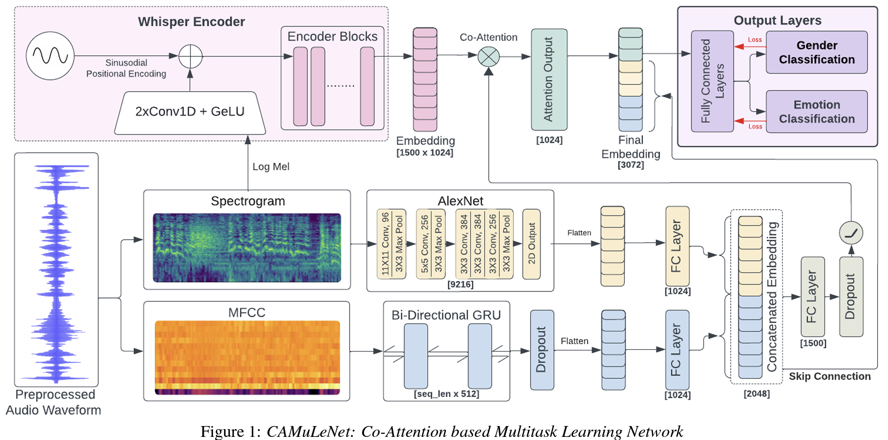
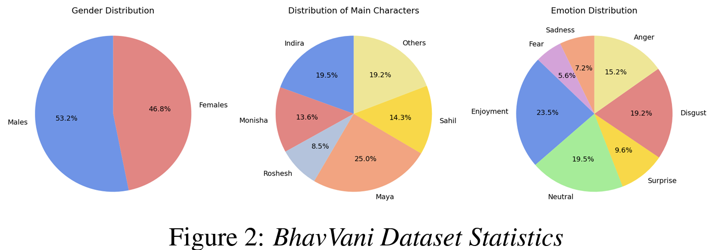
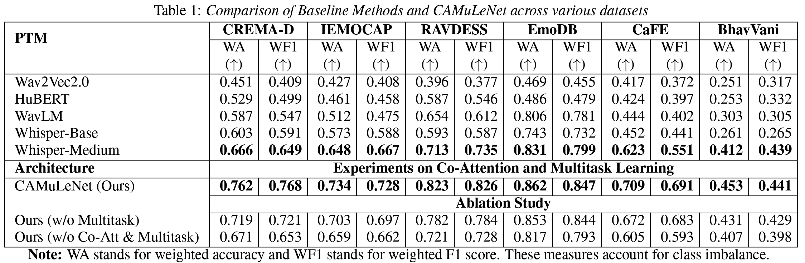

# Exploring Multilingual Unseen Speaker Emotion Recognition: Leveraging Co-Attention Cues in Multitask Learning

This repository contains the code for the INTERSPEECH'24 Paper :
`Exploring Multilingual Unseen Speaker Emotion Recognition: Leveraging Co-Attention Cues in Multitask Learning`

## Overview
In our work, we propose the following contributions:
1. We introduce the `CAMuLeNet` architecture for generalizing emotion recognition architectures to unseen speaker distributions using co-attention on features and multi-task learning:


2. We introduce the <b>first-ever</b> Hindi SER dataset - `BhavVani`. The statistics for the same are shared below:


## BhavVani Dataset
Please fill this form for accessing the BhavVani dataset: [Form Link](https://forms.gle/9AqxS2oY4XVSeH1UA)

## Environment Setup
Run the following command in your local machine, to recreate the environment we used for running our experiments:
```bash
conda env create -f environment.yml -p <CONDA PATH>
```

## Experiments and Datasets
- We benchmark our work on various language datasets for the speaker emotion recognition task. The codes for generating `{split}_data.pth` files for each dataset our provided in the `data` folder.
- Please ensure that have your generated pickle files for the corresponding dataset which is a dictionary mapping the name of the audio file to a list containing - `[whisper_embedding, MFCC, Mel-Spectrogram]`. Please run the following script to generate this `pkl` file:
```bash
python get_whisper_embeddings_and_audio_features.py\
    --home_dir __ # Path to the home directory \
    --data __ # data name \
    --model_type __ # Whisper model type (base, medium, large) \
    --split # Split name (train, val, test) \
    --r_type # Reduction type for encoder output (0: mean, 1: max, 2: min) 
```

## Training the Model
- Codes for generating features from baseline models such as `Wav2Vec2, WavLM, HuBert and Whisper` and the subsequent CNN used for emotion classification are provided in the `baseline_models` directory.
- The implementation for the `CAMuLeNet` architecture is provided in the file `model.py`.
- To train the model, ensure that you have generated `{split}_data.pth` files from the `data` folder.
- For training the architecture, run the following script:
```bash
python train.py
    --num_emotions __ # Number of emotion classes in chosen dataset\
    --data_path __ # Path to the data folder containing train, val, and test sets \
    --batch_size __ # Batch size for training \
```

## Results
We obtained the following results from our experiments:


Additionally, we generated a t-SNE visualization of the embeddings from a baseline model i.e. `Whisper-Medium` and the embeddings generated by `CAMuLeNet`.


## Citation
If our work was found helpful, please feel free to leave a star and cite our work using:
```bibtex
@inproceedings{goel24_interspeech,
  title     = {Exploring Multilingual Unseen Speaker Emotion Recognition: Leveraging Co-Attention Cues in Multitask Learning},
  author    = {Arnav Goel and Medha Hira and Anubha Gupta},
  year      = {2024},
  booktitle = {Interspeech 2024},
  pages     = {2340--2344},
  doi       = {10.21437/Interspeech.2024-1820},
  issn      = {2958-1796},
}
```
