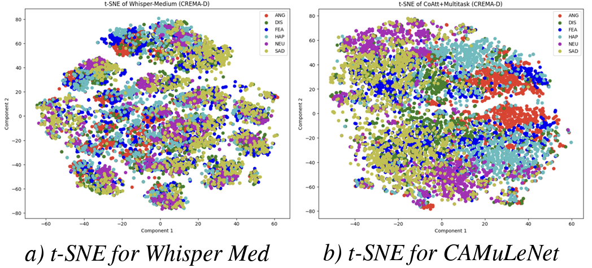

# Exploring Multilingual Unseen Speaker Emotion Recognition: Leveraging Co-Attention Cues in Multitask Learning

This repository contains the code for the INTERSPEECH'24 Paper :
`Exploring Multilingual Unseen Speaker Emotion Recognition: Leveraging Co-Attention Cues in Multitask Learning`

## Overview

## BhavVani Dataset
Please fill this form for accessing the BhavVani dataset: [Form Link](https://forms.gle/9AqxS2oY4XVSeH1UA)

## Environment Setup
Run the following command in your local machine, to recreate the environment we used for running our experiments:
```bash
conda env create -f environment.yml -p <CONDA PATH>
```

## Datasets

## Training the Model

## Embedding Visualization


## Citation
If our work was found helpful, please feel free to leave a star and cite our work using:
```bibtex
@inproceedings{goel24_interspeech,
  title     = {Exploring Multilingual Unseen Speaker Emotion Recognition: Leveraging Co-Attention Cues in Multitask Learning},
  author    = {Arnav Goel and Medha Hira and Anubha Gupta},
  year      = {2024},
  booktitle = {Interspeech 2024},
  pages     = {2340--2344},
  doi       = {10.21437/Interspeech.2024-1820},
  issn      = {2958-1796},
}
```
